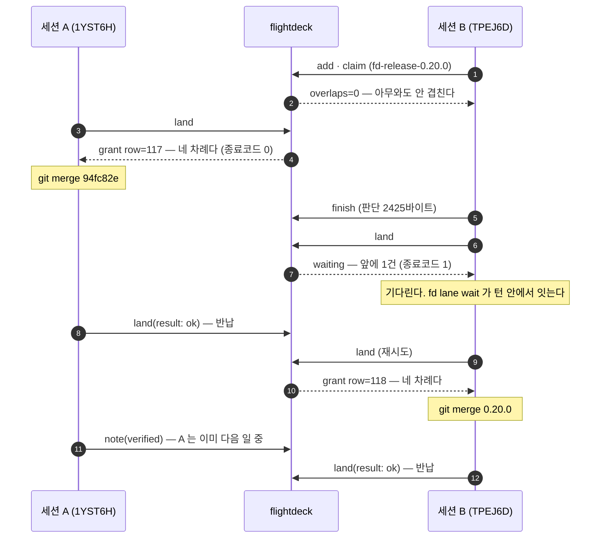
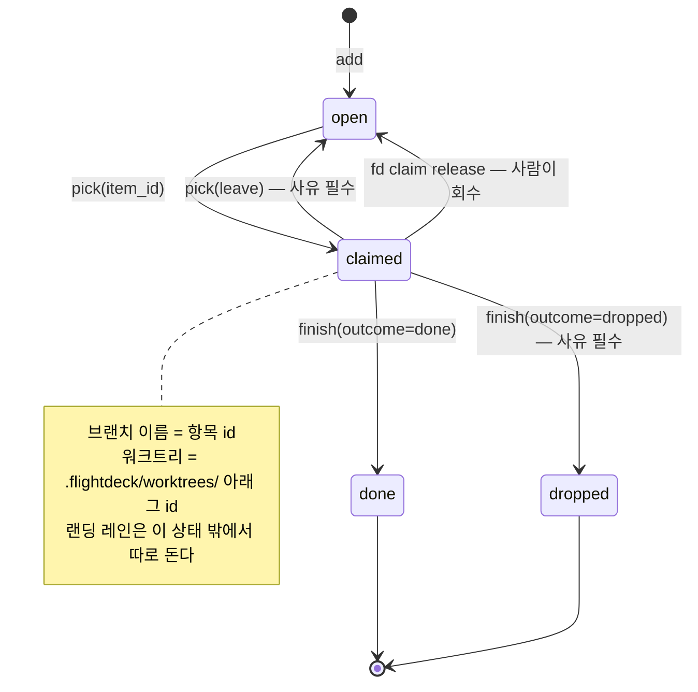

[English](README.md) | **한국어**

# flightdeck

> **이 파일이 정본이다.** 고칠 것이 생기면 여기를 먼저 고치고 [`README.md`](README.md)(영문)를
> 맞춘다. 반대로 하면 번역본이 정본을 끌고 가게 되고, 이 저장소의 커밋·판단·코드 주석이
> 전부 한글이라 그 방향은 현실과 어긋난다.
>
> GitHub 은 언어별 README 를 **자동으로 안 고른다**(`README.md` 만 렌더링한다 — GitLab 과 갈리는
> 자리다). 그래서 위 줄의 링크가 그 역할을 대신한다. 파일명 `README.ko.md` 는 ISO 639-1 을 쓰는
> 사실상의 표준 관례다.

병렬 Claude Code 세션의 조정 계층. 서버 하나에 여러 프로젝트·여러 세션이 붙는다.

세션끼리 대화할 수단이 없어 "저쪽이 뭘 집었나"를 추측하게 되고, 그 추측이 틀리면
남의 작업을 통째로 집는 사고가 난다. flightdeck 은 그 추측을 없앤다 —
누가 살아 있나 · 어느 경로를 만지나 · 무엇을 집었나를 **git 과 DB 에서 파생해서** 낸다.

새 세션을 열면 아무것도 안 쳐도 이것이 먼저 뜬다.

```
보드 · kweiza-cc-plugins · 2026-08-13 06:40 UTC · 파생 git@06:40:08 최신
잡혀 있는 작업 0건 (선점 기준이다 — 세션의 생사가 아니다)

잡혀 있는 작업이 없다 — 아무 세션도 큐 항목을 쥐고 있지 않다. 서버 장애가 아니다.
창 밖 73건 (가장 오래된 신호 8일 10시간 전) — 창은 표시 구간이지 생존 판정이 아니다
큐 열림 4건
  · 19시간 22분·티클러(08-19 발화) · fd-folded-multi-turn-drain-unmeasured — 다턴 배수가 미실측이다
  · 18시간 41분·티클러(08-26 발화) · fd-lane-turn-remeasure-… — lane-turn 축을 재측한다
랜딩 레인 0건(질의는 돌았다)
```

설계 정본은 [`DESIGN.md`](DESIGN.md) 다. 여기 없는 것은 만들지 않는다.

---

## 목차

- [왜 필요한가](#왜-필요한가)
- [병렬 세션은 이렇게 굴러간다](#병렬-세션은-이렇게-굴러간다) ← 먼저 읽을 절
- [5분 설치](#5분-설치)
- [쓰는 법](#쓰는-법)
- [실제로 이만큼 돌았다](#실제로-이만큼-돌았다)
- [서버가 죽으면](#서버가-죽으면-l1)
- [뭔가 안 될 때](#뭔가-안-될-때)
- [설계 원칙 셋](#설계-원칙-셋)

---

## 왜 필요한가

한 사람이 Claude Code 세션을 10개 넘게 병렬로 돌려 한 제품을 개발하면, 세션끼리 대화할
수단이 없어 "저쪽이 뭘 집었나"를 추측하게 된다. 그 추측이 틀리면 남의 작업을 통째로 집는
사고가 난다.

흔한 처방은 레포마다 셸 스크립트 네 벌(게시판·큐·핸드오프·대시보드)과 배타 락 다섯 종이다.
그 구조를 8축으로 실측했더니 병목이 이렇게 나왔다 — **세션 수 N 에 대해 악화하는 순서다.**

| # | 병목 | 무엇이 문제였나 |
|---|---|---|
| 1 | 대시보드 | 조정 산출물 중 유일하게 공유되는 것이라 전 세션이 2회씩 편집한다(수요 = 2N). 배타 단위가 카드 한 장이 아니라 **파일 전체**이고, 모든 커밋이 `asOf` 한 줄을 건드려 리베이스가 반드시 충돌한다 |
| 2 | 랜딩 락 | 검증 11단계 중 이미지 태그를 쓰는 것은 4단계뿐인데 **전 구간이 잠긴다** |
| 3 | 큐 착수 경로 | 1차 필터가 죽어 있고, 그 값의 출처가 브랜치 diff 라 **규율을 지킨 착수 직후 세션에는 정의상 비어 있다** |
| 4 | 수동 호출 | 세션당 20회 넘게 손으로 불러야 하는데 자동 강제 지점이 둘뿐이고, **안 불렀다는 사실조차 안 남는다** |
| 5 | 계약 락 | 세션 발자국의 절반만 덮고, 실제로 난 사고(같은 날 개정 차수 충돌)는 **락이 원리적으로 못 지키는** 논리 카운터였다 |
| 6 | 스테이징 락 | 자동 반납이 없고, 갱신을 안 해 **긴 세션이 남에게 죽은 것으로 보인다** |
| 7 | 게시판 조회 | 파일이 안 지워져 신호 대 소음이 단조 악화한다(실측 6%) |

뿌리는 하나로 모인다. **파생 가능한 사실을 손으로 다시 적는다.** 누가 살아 있나 · 무엇이
랜딩됐나 · 어느 경로를 건드리나 · HEAD 가 무엇인가는 전부 git 과 파일시스템에 이미 있다.
손으로 베낀 스냅숏은 원본이 움직이는 순간 조용히 거짓이 되고, **거짓임을 알려 주는 자리가 없다.**

flightdeck 은 그 자리들을 지운다. 파생할 수 있는 것에는 **쓰기 API 파라미터를 아예 안 만든다** —
틀리게 적을 필드가 없으면 검사할 것도 우회할 것도 없다.

---

## 병렬 세션은 이렇게 굴러간다

### ① 한 세션의 하루

```
세션이 열린다  →  SessionStart 훅이 보드를 주입한다 (아무것도 안 쳐도 뜬다)
      ↓
pick           →  "무엇을 집을까"를 추천만 한다. 아직 선점하지 않는다
      ↓
pick(item_id)  →  선점 + 항목 본문 + 연결된 판단 전문 + 브랜치·워크트리 명령
      ↓
워크트리에서 작업  →  PostToolUse 훅이 편집할 때마다 미커밋 발자국을 보고한다
      ↓
finish         →  판단 + 후속 등록 + 항목 종료 + 자원 반납이 한 호출·한 트랜잭션
      ↓
land           →  랜딩 줄에 선다. 내 차례면 종료코드 0, 아니면 1
      ↓
머지하고 land(result: ok)  →  레인 반납. 다음 세션이 들어온다
```

핵심은 **`pick` 이 두 단계라는 것**이다. 인자 없이 부르면 추천과 **탈락 사유 전부**를 내고
선점하지 않는다. 그래서 "뭘 집을지 보기"가 남의 후보를 뺏지 않는다.

### ② 두 세션이 같은 파일을 만지면 — 겹침

락을 걸지 않는다. **알린다.** 그리고 거르지 않는다.

편집할 때마다 `PostToolUse` 훅이 미커밋 발자국을 서버에 보낸다. 다른 세션의 발자국과
경로가 겹치면, 턴이 끝날 때 `Stop` 훅이 처방을 물어 화면에 주입한다.

원장에 실제로 남은 처방이다(2026-08-13):

```json
{
  "key": "overlap:01KZWPMRGEEX81D8VFKTJ9MKHJ",
  "reason": "이번에 만진 CLAUDE.md 가 세션 01KZWPMRGEEX81D8VFKTJ9MKHJ 의
             발자국 CLAUDE.md 와 겹친다(겹친 쌍 1)",
  "sibling_claims": ["ddl-backfill-createdat-signal-comment-misleading",
                     "mcp-server-exchange-opaque-token-hole", … 9건],
  "workspace_claims": ["mcp-server-exchange-opaque-token-hole"]
}
```

여기서 중요한 것은 **막지 않는다**는 점이다. 겹침은 사고가 아니라 정보다 — 한 줄 순삽입과
47줄 개정이 같은 무게로 뜨면 안 되므로 규모(`+증가/-감소`)를 함께 내고 큰 것부터 세운다.
**못 잰 것은 0 이 아니라 `(규모?)` 로 낸다.**

그리고 `pick` 은 겹침을 **거르지 않고 명시한다**:

```
겹침 판정 범위: 항목 fd-… 의 경로만 봤다 — 이 응답이 합친 경로는 그것뿐이다.
겹침: 없음 — 살아 있는 세션 어느 것과도 경로가 안 겹친다.
```

침묵하면 "겹침 없음"과 "이 축을 안 본다"가 구분되지 않는다. 그래서 **안 본 축도 말한다.**

### ③ 두 세션이 동시에 머지하려 하면 — 랜딩 레인

여기만 진짜 배타다. 나머지는 전부 알림이다.

아래는 **원장에 남은 실제 이벤트**다(2026-08-12, 이 저장소, 세션 id 끝 6자리로 표기):

```
14:08:14.889  TPEJ6D  item.add      fd-release-0.20.0
14:08:20.806  TPEJ6D  item.claim    overlaps=0  outside=0  paths=1
14:08:56.771  1YST6H  lane.land     mode=acquire
14:08:56.773  1YST6H  lane.grant    row=117          ← A 가 2ms 만에 차례를 받는다
14:11:39.384  TPEJ6D  item.finish   판단 2425바이트
14:11:42.119  TPEJ6D  lane.land     mode=acquire     ← B 가 줄을 선다. grant 가 안 온다
14:11:43.187  1YST6H  lane.report   mode=ok          ← A 가 머지를 끝내고 반납
14:11:51.975  TPEJ6D  lane.land     mode=acquire
14:11:51.979  TPEJ6D  lane.grant    row=118          ← B 가 차례를 받는다
14:12:16.564  1YST6H  judgment.note verified          ← A 는 기다리지 않고 다음 일로 갔다
14:14:33.211  TPEJ6D  lane.report   mode=ok
```

두 줄행이 실제로 무엇이었는지도 원장에 있다:

- `#117` — `94fc82e (merge) ← 8a14eaf`. "event.kind 10종"이라 적힌 거짓을 전수(33종)로 정정
- `#118` — `0.20.0 릴리스 머지`. plugin.json 한 줄. 머지 후 main 에서 gofmt·vet 무출력, 13개 패키지 ok

시간순으로 그리면 이렇다.



**`fd land` 의 종료코드가 답하는 질문은 "요청이 성공했나"가 아니라 "지금 랜딩해도 되는가"** 다.
그래서 이 한 줄이 그대로 성립한다:

```bash
fd land && git merge --ff-only "$BRANCH"
```

`turn`·`released`·`left` 만 0 이고 `waiting`·`reclaimed`·모르는 상태는 전부 1 이다 —
대기에 0 을 내면 그 한 줄이 배타를 통째로 우회하는데 서버는 내내 옳고 아무 로그도 안 남는다.

### ④ 항목은 이 길을 돈다



전이마다 도구가 하나씩 붙는다.

| 전이 | 도구 | 무엇이 함께 일어나나 |
|---|---|---|
| `→ open` | `add` | 항목 id 가 **그대로 브랜치 이름**이 된다. 전역 유일이라 브랜치 충돌이 구조적으로 소멸한다 |
| `open → claimed` | `pick(item_id)` | 선점 + 연결된 판단 전문 + 겹침 + 워크트리 명령이 한 응답에 온다 |
| `claimed → open` | `pick(leave:)` | **id 와 이력이 산다.** `finish(dropped)` 로 때우면 id 가 바뀌어 이력이 끊긴다 |
| `claimed → done` | `finish` | 판단·후속 등록·종료·반납이 **한 트랜잭션**. 중간에 실패하면 통째로 롤백된다 |
| (언제든) | `note` | 파생 불가능한 유일한 자산 — 왜 그렇게 했나, 무엇을 기각했나, **일부러 안 한 것** |
| (랜딩 시) | `land` | 항목 상태와 무관하게 도는 별도 줄. 자원 이름을 주면 그 자원의 줄에 선다 |

### ⑤ "저 세션 살아 있나"에는 답하지 않는다

이 도구에는 **생존 판정 불리언이 없다.** 만드는 순간 그것이 회수·회피·탈락 셋의 상류가 되기
때문이다. 그 판정은 실측에서 두 번 틀렸다 — 죽었다고 판정한 세션이 그 뒤 **6커밋을 랜딩했고**,
419분 무갱신으로 표시된 세션이 실제로는 **17초 전에 살아 있었다.**

대신 신호 넷을 **나란히** 낸다. 합치지 않는다.

| kind | 언제 찍히나 | 무슨 뜻인가 |
|---|---|---|
| `prompt` | `UserPromptSubmit` | 사람이 지금 몰고 있다 — 가장 강한 신호 |
| `tool` | `PostToolUse(Edit\|Write)` | 에이전트가 일하고 있다(사람이 자리를 비워도) |
| `mcp` | MCP 도구 호출 | 세션이 살아 있다 — 일하고 있다는 뜻은 **아니다** |
| `commit`·`push` | 서버의 git 리더가 직접 관측 | **클라이언트를 안 믿는 유일한 신호** |

`prompt` 와 `tool` 을 가른 이유가 있다. 에이전트가 20분짜리 도구를 돌리는 동안 `prompt` 는
안 오지만 `tool` 은 온다. 반대로 사람이 읽기만 하는 동안은 `prompt` 만 온다.
**하나만 보면 둘 중 한 상황을 반드시 오판한다.**

그래서 화면은 **"죽었다"고 쓰지 않고 나이를 숫자로만 낸다.** 회수가 필요하면 사람이,
사유와 함께, 근거 여섯 축을 나란히 본 뒤에 한다.

> **★ 반드시 알아야 하는 한계** — 창을 닫고 나간 세션·`tmux kill`·SIGKILL 은 종료 경로를
> 안 지난다(플랫폼이 프로세스 종료를 안 알려 준다). 그 카드는 창(기본 2시간)으로만 사라진다.
> 실측: 보드가 카드 26장을 냈을 때 `/proc` 으로 잰 살아 있는 프로세스는 **5개**였다.
> 이 한계를 모르면 "닫히니까 카드는 항상 정확하다"고 믿게 되고, 그 믿음이 위의 두 오판을 다시 만든다.

---

## 5분 설치

**플러그인을 이미 켰다면 `fd-setup` 스킬이 아래를 대신 해 준다** — 상태를 재고, 서버로 쓸지
클라이언트로 붙을지 묻고, 없는 것의 설치 명령을 **승인받아** 실행한다. 판정은 `fd setup` 이
내므로 그 명령을 직접 쳐도 같은 값이 나온다. 아래는 그 스킬이 하는 일의 정본이다.

### 1. 서버를 띄운다 (한 머신에서 한 번)

```bash
cd plugins/flightdeck
FD_TOKEN="$(cat ~/.flightdeck/token 2>/dev/null)" docker compose up -d
curl -s localhost:7420/healthz
```

`{"ok":true,"api_version":"1","db_ok":true,…}` 가 나오면 됐다.
화면은 <http://localhost:7420> — 읽기 전용 한 장이다.

세 가지를 환경에서 받는다:

- **`FD_TOKEN`** — 안 주면 인증이 꺼진 채 뜬다. 그 사실은 `/healthz` 가 말하지만,
  **말할 뿐 막지는 않는다.** 이미 토큰을 쓰던 서버를 옮기는 중이라면 반드시 같은 값을 준다.
  컨테이너로 띄우면 호스트에서 오는 요청도 **루프백이 아니다**(브리지 게이트웨이로 보인다) —
  즉 토큰 면제가 안 걸리므로, 클라이언트 쪽도 `fd setup --token …` 으로 같은 값을 가져야 한다.
- **`FD_UID`/`FD_GID`** — 볼륨 `~/.flightdeck` 와 저장소는 호스트 사용자의 것이다.
  기본값 1000 이 아니면(`id -u`) 주지 않는 한 DB 를 열되 못 쓰고, git 은 소유권을 의심한다.
- **`FD_REPOS`** — 저장소들이 있는 자리(**기본 `$HOME`**). **파생의 전부가 여기서 나온다** —
  브랜치 · sha · 미커밋 발자국 · 경로 겹침. 안 붙이면 서버는 정상으로 보이면서 보드에
  `브랜치 ?(못 읽음)` 만 적는다. 호스트와 컨테이너의 경로가 **같아야 한다**(워크트리의
  `.git` 이 주 저장소를 절대경로로 가리키기 때문이다).
  **갱신할 때 이 값을 잃지 마라** — compose 치환 시점에만 쓰이고 컨테이너 env 에도 안 남아
  흔적이 마운트뿐이다. `up` 에 안 주면 조용히 기본값으로 되돌아간다(실측: 그렇게 등록 7건 중
  6건이 파생 불능이었고 `healthz` 는 ok 였다). 이전 값은 **내리기 전에** `docker inspect` 로 읽는다.
- **`FD_REPOS2` · `FD_REPOS3` · `FD_REPOS4`** — 저장소가 여러 트리에 흩어져 있을 때 쓰는 **추가 슬롯**
  (상한 넷). 홈을 통째로 붙이는 대신 필요한 루트만 골라 붙여 `.ssh`·`.claude` 노출을 없앨 수 있다.
  안 쓴 슬롯은 첫 슬롯으로 **자동으로 접힌다** — compose 가 같은 경로의 중복 마운트를 하나로 합친다.
  **콜론 구분은 안 된다**(`FD_REPOS=/a:/b`) — compose 의 한 항목이 한 경로다.
  다섯째가 필요하면 슬롯을 늘려라. 안 늘리고 주면 **조용히 안 붙는다.**

플러그인으로 켰다면 저장소가 아니라 **설치된 캐시 자리**에서 띄운다 — 그것이
`/plugin` 이 받아 둔 그 판이다:

```bash
cd ~/.claude/plugins/cache/<마켓플레이스>/flightdeck/<버전>
```

도커 없이 돌리려면:

```bash
cd server && go run ./cmd/fd serve --addr :7420 --db ~/.flightdeck/fd.db
```

> **컨테이너 대신 쓰는 명령이다 — 같이 돌리지 마라.** compose 가 `~/.flightdeck:/data` 를
> 마운트하므로 위의 `--db` 는 **컨테이너가 쥔 바로 그 DB** 다. 같은 포트면 바인드에서
> 멈추지만(그때는 원장을 안 건드린다), 포트만 바꿔 띄우면 그 임시 바이너리가 원장에
> **배포로 적힌다** — 그 뒤 컨테이너가 재기동하면 배포가 한 건 더 생긴다.
> 컨테이너를 띄운 채 실험하려면 `--db` 도 함께 딴 자리로 돌려라.

### 2. 플러그인을 켠다 (세션을 돌리는 머신마다)

이 레포가 마켓플레이스다. `/plugin` 에서 `flightdeck` 을 켜거나, 설정에 직접 넣는다.

```
/plugin marketplace add kweiza/kweiza-cc-plugins
/plugin install flightdeck@kweiza-cc-plugins
```

켜면 다음이 자동으로 붙는다.

| 무엇 | 언제 |
|---|---|
| `SessionStart` 훅 | 세션을 등록하고 보드 요약·내 선점·미확인·**서버 상태 배너**를 주입한다 |
| `UserPromptSubmit` 훅 | `prompt` 신호 + 미확인 알림 |
| `PostToolUse`(Edit\|Write) 훅 | `tool` 신호 + **미커밋 발자국** — 경로 겹침 축의 유일한 원천 |
| `PreCompact` 훅 | 압축 직전 좌표를 초안 판단으로 남긴다 |
| `Stop` 훅 | 턴이 끝날 때 처방을 물어 `additionalContext` 로 주입한다 |
| `SessionEnd`(clear) 훅 | `/clear` 로 대화가 떠난 것을 관측으로 남긴다 |
| MCP 도구 8개 | `board` `pick` `note` `add` `finish` `alloc` `land` `label` |
| 스킬 4개 | `fd-pickup` · `fd-handoff` · `fd-setup` · `fd-update` |

**훅은 전부 fail-open 이다.** `bin/fd` 는 셸 런처고, 첫 훅이 `server/` 를 빌드해
`~/.cache/flightdeck/bin` 에 **소스 트리별로** 캐시한다 — 자리가 채널(훅·MCP·셸)을 안 타고,
서로 다른 소스 트리는 **서로 다른 파일**을 갖는다. **Go 가 없으면 안내만 내고 세션은 그대로
진행된다.**

### 3. 서버가 다른 머신이면 주소를 알려준다

```bash
export FD_URL=http://<서버머신>:7420
export FD_TOKEN=<서버와 같은 토큰>   # 서버에 FD_TOKEN 을 줬을 때만
```

토큰을 안 주면 인증이 꺼진다. **그 사실은 `/healthz` 가 알린다** — 조용히 열어 두지 않는다.

### 4. codex 에서도 쓰려면

같은 보드에 codex 세션을 올릴 수 있다. 겹침 처방이 두 하네스를 함께 보는 것이 이 기능의 목적이다.

```bash
fd setup --install-codex
```

이것이 깔아 주는 것은 둘이다 — 고정 경로 래퍼 `~/.local/bin/fd-hook` 과 `~/.codex/hooks.json`.
**기존 `hooks.json` 은 절대 안 덮는다.** 이미 있으면 넣을 내용을 화면에 내고 멈추므로 손으로 병합해라.

#### ★ 그리고 반드시 TUI 를 한 번 띄워라

```bash
codex        # "Hooks need review" 를 통과시킨다
```

**이것을 안 하면 훅은 한 번도 안 돈다.** codex 는 신뢰받지 않은 훅을 **조용히 건너뛴다** —
`codex exec` 로만 쓰면 승인 화면을 볼 기회가 영영 없고, 보드에 카드가 안 뜨는 이유를
어디에서도 알 수 없다. 로그에 훅 얘기가 **한 줄도 안 나온다.**

신뢰가 붙으면 반대로 로그가 말해 준다 — `hook: SessionStart` … `hook: SessionStart Completed`.
그 줄의 유무가 곧 신뢰 여부다.

#### 왜 훅 명령이 그렇게 생겼나

신뢰는 `~/.codex/config.toml` 에 이렇게 박힌다:

```toml
[hooks.state."/Users/…/.codex/hooks.json:session_start:0:0"]
trusted_hash = "sha256:086dc4d6…"
```

**그 해시는 훅 정의(명령 문자열)만 본다.** 스크립트 내용은 안 본다 — 명령을 한 글자 바꾸면
신뢰가 깨지고, 원복하면 내용을 통째로 갈아도 다시 돈다.

그래서 훅 명령이 `~/.local/bin/fd-hook` 이라는 **고정 경로**를 부른다. 여기에
`${CLAUDE_PLUGIN_ROOT}/bin/fd` 처럼 버전이 든 경로를 쓰면 **fd 를 판올림할 때마다 TUI 재승인**이고,
재승인 전까지 훅이 조용히 죽는다. 래퍼가 그 안에서 설치본 중 최신 판을 고르므로
**판올림해도 명령 문자열은 안 바뀐다.**

> 이 래퍼는 **정식 플러그인 설치본만** 고른다. 저장소 체크아웃은 일부러 안 본다 —
> 그러면 낡은 판이 최신인 척 돌고 아무도 모른다.

#### 안 되는지 재는 법

```bash
fd doctor        # ■ codex 절
```

네 축을 이름으로 낸다: 훅 파일 · **훅 신뢰** · 훅 명령(고정 경로인가) · 훅 래퍼.
신뢰가 없으면 그 줄이 `✗` 로 뜨고 무엇을 해야 하는지 말한다. **무출력은 통과가 아니다** —
codex 자신의 `codex doctor` 는 훅을 한 마디도 안 재므로(체크 19개 어디에도 없다) 이 화면이
유일한 관측 창구다.

#### 샌드박스 네트워크

codex 기본 샌드박스는 네트워크를 끊고, 그 상태의 fd 는 서버에 **통째로 못 붙는다**
(`connect: operation not permitted`).

```bash
codex -c sandbox_workspace_write.network_access=true
```

또는 `~/.codex/config.toml` 에 박아라. 이것은 당신의 샌드박스 정책을 여는 일이다 —
무엇을 왜 여는지 알고 켜라.

#### MCP 도구는 아직 codex 에서 안 붙는다

codex 에 MCP 를 붙일 수는 있다:

```toml
[mcp_servers.fd]
command = "/Users/…/.local/bin/fd-hook"
args = ["mcp", "--harness", "codex"]
env = { FD_URL = "http://127.0.0.1:7420", FD_TOKEN = "…" }
```

**`env` 를 반드시 명시 주입해라.** codex 는 MCP 자식에게 코어 13개(HOME·PATH·PWD 등)만 주고
부모의 `FD_URL`·`FD_TOKEN` 을 **안 물려준다**(훅과 셸 도구는 전량 상속한다 — MCP 만 다르다).

다만 **지금은 여기까지다.** codex 는 MCP 자식에게 세션 id 도 안 주고(`CODEX_SESSION_ID` 는
셸에만 온다), 프로세스 계보로 알아내는 길은 macOS 에서 막혀 있다. 그래서 codex 세션의
MCP 도구는 자기가 **어느 세션인지 모른다.** 훅이 남긴 cwd 좌표를 읽어 붙는 설계가 DESIGN
「하네스 축」 절에 있으나 아직 구현 전이다.

**그동안 codex 에서는 터미널의 `fd` 를 써라** — 셸 도구는 환경을 전량 상속하고
`CODEX_SESSION_ID` 도 오므로 그쪽은 정상으로 돈다.

| codex 에서 | 지금 되나 |
|---|---|
| 훅(세션 카드 · 발자국 · 겹침 처방 · 배너) | ✅ |
| 터미널 `fd` (`board`·`pick`·`note`·`finish`) | ✅ |
| MCP 도구 8개 | ❌ 세션 정체를 못 얻는다 |

---

## 쓰는 법

### 세션 안에서 — MCP 도구 8개

외워야 할 것은 넷이다: **집고(`pick`) · 남기고(`note`) · 끝내고(`finish`) · 줄 선다(`land`).**

| 도구 | 파라미터 | 언제 부르나 |
|---|---|---|
| `board` | `detail` | 지금 어느 작업이 잡혀 있나. 선점을 든 카드만 낸다 |
| `pick` | — | 추천 1건 + 왜 + **탈락 사유 전부**. 선점하지 않는다 |
| `pick` | `item_id` / `item_ids` | 선점 + 항목 본문 + 연결된 판단 + 브랜치·워크트리 명령 |
| `pick` | `leave` | 내 선점을 놓는다. 항목은 `open` 으로 돌아가고 **id·이력이 산다** |
| `note` | `kind` `body` `item_id` `supersedes` | 판단을 남긴다. 종류 8: `handoff` `decision` `blocked` `ask` `rejected` `not-done` `verified` `draft` |
| `add` | `id` `title` `body` `paths` `after` `labels` | 큐 항목. **id 가 그대로 브랜치 이름**이 된다 |
| `finish` | `item_id` `outcome` `body` `followups` | 판단+후속+종료+반납을 한 호출·한 트랜잭션으로 |
| `alloc` | `counter_name` | 원자 발번(개정 차수 같은 논리 카운터) |
| `land` | `resources` `result` `detail` `leave` | 랜딩 줄에 선다 / 내 차례를 본다 / 보고하고 반납한다 |
| `label` | `item_id` `add` `rm` | 표시 전용 꼬리표. `tickler` 만 굶김 축에서 빠진다 |

세 가지 규율이 이 표에 숨어 있다.

1. **후속은 `add` 가 아니라 `finish` 의 `followups` 에 싣는다.** 미리 `add` 하면 판단과의
   연결을 영영 못 산다 — 같은 호출에 넣어야 판단에 이어진다.
2. **선점을 놓을 때는 `pick(leave:)` 다.** `finish(dropped)` 로 때우면 id 가 바뀌어 이력이 끊긴다.
3. **판단은 덮어쓰지 않는다.** 정정은 `note(supersedes: <판단 id>)` 로 새 행을 얹는다.

### 터미널에서 — `fd`

```bash
fd status                 # 서버 상태 배너 + 보드
fd next                   # 추천만
fd pick <item-id> [<item-id>…]  # 선점(여럿이면 첫째가 선두)
fd note --kind decision --body "왜 그렇게 했나"
fd finish <item-id> --outcome done --body "① 왜 ② 기각 ③ 안 한 것 ④ 확인만 한 것"
fd land                   # 랜딩 줄에 선다(--ok|--fail <사유>|--leave <사유> 로 보고·이탈)
fd lane wait              # 내 차례를 턴 안에서 기다린다
fd lane release --row <id> --reason "왜 끊었나"   # 물린 줄 행을 사람이 회수한다
fd claim release --item <id> --reason "왜 끊었나" # 무신호 세션의 선점을 사람이 회수한다
fd doctor                 # 이 머신의 플랫폼 축과 서버 상태를 실제로 잰다
```

### 스킬 4개 — 순서를 외우지 않으려고 있다

| 스킬 | 언제 | 무엇을 하나 |
|---|---|---|
| `/fd-setup` | 머신을 처음 켤 때 | 상태를 재고 서버/클라이언트를 정한 뒤 **필요한 것만** 설치·기동 |
| `/fd-pickup` | 세션을 시작할 때 | 보드 확인 → 추천 → 선점 → **연결된 판단 읽기** 순서로 |
| `/fd-handoff` | 작업이 끝났을 때 | 판단 저장 + 후속 등록 + 항목 종료 + 자원 반납을 한 호출로 |
| `/fd-update` | 보드가 낡았을 때 | 서버·플러그인·DB 를 최신으로 |

---

## 실제로 이만큼 돌았다

2026-08-03 이후 열흘 동안 이 저장소에 **759 커밋**이 쌓였다(8월 12일 하루에만 115건).
아래는 같은 서버가 물고 있는 원장의 실측이다 — 추정치가 아니라 쿼리 결과다(2026-08-13 06:40 UTC).

| 축 | 저장소 A (사내 제품) | 이 저장소 |
|---|---|---|
| 큐 항목 | 830 | 245 |
| 판단(judgment) | 2,015 | 745 |
| 세션 카드 | 331 | 300 |
| 선점 | 472 | 240 |
| 랜딩 줄서기 | 56회 (성공 48) | 101회 (성공 99) |
| **동시에 선점을 든 세션 최대** | **7개 세션 · 61항목** | 5개 세션 · 13항목 |
| 랜딩 레인 동시 대기 최대 | 6건 | 2건 |

선점이 아니라 **하트비트**로 세면 더 큰 수가 나온다. `session.beat` 17,195건을 슬라이딩 창으로
훑으면:

| 창 | 동시에 신호를 낸 세션 | 언제 |
|---|---|---|
| 5분 | **18개** | 2026-08-05 03:07 UTC |
| 10분 | **24개** | 2026-08-05 02:33 UTC |

24개 순간의 내역은 저장소 A 12 · 이 저장소 10 · 그 밖 2, 고유 워크트리 16개다.
**한 머신에서 24개 세션이 동시에 뛰었고 그중 22개가 같은 두 저장소를 만지고 있었다.**

겹침 처방은 601건 나갔고, 이유별로 이렇게 갈린다.

| 처방 종류 | 건수 | 무엇을 말했나 |
|---|---|---|
| `overlap` | 352 | 네가 만진 경로가 저 세션의 발자국과 겹친다 |
| `unclaimed` | 124 | 선점 없이 편집하고 있다 |
| `silent` | 84 | 오래 조용하다 |
| `outside` | 41 | 선점한 항목의 경로 밖을 만지고 있다 |

전체 원장은 이벤트 39,381건 · 판단 2,766건 · 발자국 3,618행이다.

> **이 수들은 전부 하한이다.** 이유가 둘이다.
>
> ① 이벤트 쓰기 실패는 WARN 으로만 삼키고, 트랜잭션이 시작 전에 실패하면 이벤트를
> 예약조차 안 한다. **"0건"은 "없었다"가 아니다** — 임계값을 세우는 데 쓰면 안 된다.
> ② `claim` 의 PK 가 `(project, item_id)` 라 **같은 항목을 다시 집으면 앞 행을 덮어쓴다.**
> 실제로 `claim` 표는 701행인데 `item.claim` 이벤트는 734건이다. 위의 동시 선점
> 최대치는 그만큼 낮게 잡힌 값이다.

---

## 서버가 죽으면 (L1)

`SessionStart` 가 배너를 **명시 주입**한다. 조용히 두면 에이전트가 조정 기구가 있는 줄 알고 움직인다.

```
⚠ 조정 서버 미도달(http://localhost:7420, 마지막 접속 14:02 · 37분 전).
  되는 것: 코드 작성·커밋·조사 전부. 이미 선점한 항목의 작업.
  안 되는 것: 새 항목 선점 · 다른 세션의 현재 상태.
  아래는 14:02 시점의 스냅숏이다. 그 뒤 남이 무엇을 집었는지는 알 수 없다.
```

- **읽기** — 마지막 성공 응답을 낡음 배너와 함께 낸다. 침묵하지 않는다.
- **판단·노트** — 아웃박스에 쌓이고 재연결 시 **멱등 재생**된다. 종료코드 0.
- **선점** — 거절된다. 배타는 서버만 보장할 수 있고, 오프라인 획득을 허용하면 배타가 거짓이 된다.
- **발번** — 거절된다. 오프라인에서 발급하면 두 세션이 같은 번호를 쓴다.
- **랜딩 레인 넷**(`land` 취득 · 보고 · 이탈 · `lane release`) — 전부 거절되고 **사유가 셋으로 갈린다.**
  취득은 배타의 정본이 서버 DB 제약이라 여기서 "내 차례"를 만들면 두 세션이 동시에 랜딩한다.
  보고·이탈은 재생 시점에 이미 남이 레인을 잡았을 수 있어 재생하면 **남의 점유를 반납한다.**
  회수는 지금 무엇이 물렸나를 보고 사람이 내린 판정이라, 재생 시점의 레인은 그 판정이 본 레인이 아니다.
- **선점 회수**(`fd claim release`) — 거절된다. 같은 이유에 하나가 더 붙는다: 재생 시점에는
  그 세션이 되살아나 일하고 있을 수 있다(생존 오판 실측 2회가 자동 회수를 기각한 그 축이다).

<details>
<summary><b>상태를 세 자리로 갈라 둔 이유</b> (심화)</summary>

**상태는 한 자리가 아니라 세 부류로 갈라 둔다.** 가르는 축은 둘이다 — ① 재생성 가능한가
② 갈린 사본이 각자 옳은가. 둘 다 "예"인 것만 채널마다 갈리는 자리에 남는다.

| 무엇 | 어디 | 왜 |
|---|---|---|
| **응답 캐시** | `${CLAUDE_PLUGIN_DATA}` | 다시 만들면 되고, 갈려도 **각자 옳다** — 값에 시각이 붙어 "낡음: 37분 전"으로 스스로 말한다. `${CLAUDE_PLUGIN_ROOT}` 는 갱신마다 경로가 바뀌므로 거기 두지 않는다 |
| **바이너리 캐시** | `~/.cache/flightdeck/bin/fd-<소스 트리>` | 다시 만들 수는 있지만 exec 되면 **어느 판인지 안 말한다** — 두 벌이 다르면 하나는 최신인 척하는 옛 코드다. 그래서 채널을 안 타는 고정 자리에 두고 이름에 소스를 박는다 |
| **판단·정체** (아웃박스·`machine-id`·`config.json`·비콘) | `~/.flightdeck` | 재생성 불가하거나 같은 머신이면 같아야 한다. 갈린 자리에 두면 셸에서 쌓인 판단을 훅·MCP 가 **영영 못 보낸다** |

`FD_STATE_DIR` 를 주면 셋 다 그 아래로 모인다 — 채널이 아니라 **사람이** 지정하는 축이라
프로세스마다 갈리지 않는다.

**옛 자리에 남은 옛 바이너리는 옮기지도 지우지도 않는다.** 복사하면 mtime 이 따라와 필요한
재빌드를 억제하고, 재빌드는 어차피 1초 안이다. 대신 **`fd doctor` 가 말은 한다**:

```
! 옛 바이너리 자리 /home/you/.local/state/flightdeck/bin — fd 1개 · 22.1MB(아무도 안 쓴다. 지우려면 사람이 지운다)
```

**doctor 는 말만 한다. 지우는 것은 사람이 한다:**

```sh
rm -f ~/.local/state/flightdeck/bin/fd ~/.claude/plugins/data/*/flightdeck/bin/fd
```

위 진단 줄은 **이 채널이 계산할 수 있는 자리만** 본다 — 사용자 셸에는 대개
`${CLAUDE_PLUGIN_DATA}` 가 안 걸려 있어 두 자리 중 **한 줄만** 뜬다(그 사실을 doctor 가 바로
아래 줄에 스스로 적는다). 그래서 위 `rm` 은 doctor 가 말한 자리보다 넓다.
`${CLAUDE_PLUGIN_DATA}` 를 그대로 명령에 쓰지 마라 — 안 걸려 있으면 `/flightdeck/bin` 으로 편다.
그 자리를 아직 물고 도는 프로세스가 있어도 안전하다(unlink 는 inode 를 안 건드린다).
반대로 **이 축을 되돌린다면** GC 도 함께 사라지므로 `rm -rf ~/.cache/flightdeck/bin` 을 한 번
쳐야 새 자리에 남은 벌들이 주인을 찾는다.

</details>

---

## 뭔가 안 될 때

```bash
fd doctor
```

플랫폼 축을 **하나씩 이름으로** 낸다. `CLAUDE_CODE_SESSION_ID` 가 `✗` 면 세션 정체의 원천이 끊긴 것이고,
그때 이 도구는 세션을 지어내지 않고 거절한다. 부재를 기본값으로 접으면 그 사실이 영영 안 보인다.

| 증상 | 볼 곳 |
|---|---|
| 보드 ①이 비어 있다 | **먼저: 아무도 항목을 안 쥐고 있으면 그것이 정상이다.** ①은 선점을 든 카드만 낸다 — 화면이 "서버 장애가 아니다"와 접은 수를 함께 말한다. 그래도 이상하면 `fd doctor` 의 `FD_URL` · 서버 로그의 `기동` 줄 · 다른 세션이 같은 서버를 보나 |
| 훅이 아무것도 안 한다 | `bin/fd` 를 직접 돌려 봐라. Go 가 없으면 안내가 나온다 |
| 포트가 안 열린다 | 서버 로그의 `서버를 띄우지 못했다` 줄에 처방이 함께 있다 |
| 도구가 안 보인다 | `.mcp.json` 의 `type` 이 `stdio` 인가 — 없으면 서버가 통째로 스킵된다 |
| 보드에 `브랜치 ?(못 읽음)` | 서버 컨테이너에 저장소가 안 마운트됐다(`FD_REPOS`). `fd status` 의 `파생 git@` 이 진단이다 |

---

## 설계 원칙 셋

충돌하면 위가 이긴다.

1. **파생 가능한 사실에는 쓰기 API 파라미터를 만들지 않는다.** 검사가 아니라 **부재**로
   강제한다. `--force` 도 `SKIP=1` 도 그 축에는 존재할 수 없다 — 우회할 필드가 없으므로.
2. **세션이 외워야 할 개념 수를 늘리는 기능은 만들지 않는다.** 성공 지표는 세션당 쓰기 호출 수와
   대체되는 규율 산문의 분량이다. 도구가 늘면 규율의 뒤쪽(핸드오프·후속 등록·해제)이 먼저 빠진다.
3. **정합성 경로는 REST, MCP 는 그 위의 얇은 껍데기.** 둘 다 같은 순수 함수를 부른다. 두 벌이 아니다.

### 안 만든 것

머지 큐·러너(Tier B) · 이벤트 소싱 · 표류 자동 탐지기 · RBAC · 선점의 오프라인 재생 ·
**생존 판정 불리언**. 각각의 이유는 [`DESIGN.md`](DESIGN.md) §11 에 있다.

> Tier B 를 안 만든 흔적이 원장에 그대로 있다 — `job` 표는 **0행**이고,
> `item.landed_ref` 는 1,073행이 **전부 NULL** 이다. 그 칸은 "러너가 실제로 fast-forward 한
> sha"만 받는데 Tier A 에는 러너가 없다. 그래서 랜딩 수는 `landed_ref` 가 아니라
> `landing_queue.left_kind='ok'` 로 센다.
