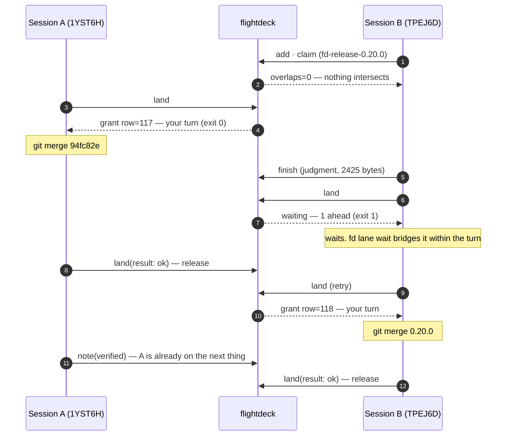
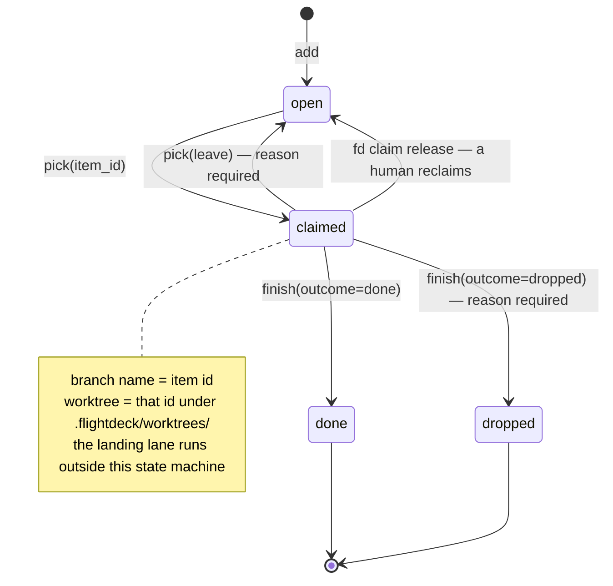

**English** | [한국어](README.ko.md)

# flightdeck

A coordination layer for parallel Claude Code sessions. One server; many projects, many sessions.

Sessions have no way to talk to each other, so each one *guesses* what the others picked up — and
when the guess is wrong, one session takes over work another session is already doing. flightdeck
removes the guess: who is alive, which paths they touch, what they claimed are all
**derived from git and the database**.

Open a new session and this appears before you type anything:

```
보드 · kweiza-cc-plugins · 2026-08-13 06:40 UTC · 파생 git@06:40:08 최신
잡혀 있는 작업 0건 (선점 기준이다 — 세션의 생사가 아니다)

잡혀 있는 작업이 없다 — 아무 세션도 큐 항목을 쥐고 있지 않다. 서버 장애가 아니다.
창 밖 73건 (가장 오래된 신호 8일 10시간 전) — 창은 표시 구간이지 생존 판정이 아니다
큐 열림 4건
  · 19시간 22분·티클러(08-19 발화) · fd-folded-multi-turn-drain-unmeasured — 다턴 배수가 미실측이다
  · 18시간 41분·티클러(08-26 발화) · fd-lane-turn-remeasure-… — lane-turn 축을 재측한다
랜딩 레인 0건(질의는 돌았다)
```

> **The tool speaks Korean.** Every runtime surface — the board, prescriptions, refusal messages,
> `fd doctor` — is Korean, and this README quotes it verbatim rather than translating it, so that
> what you read here is what you will actually see. Each quote is explained in English right below it.
> The document of record is [`DESIGN.md`](DESIGN.md), also Korean.
>
> **Korean is the source of truth for this documentation.** [`README.ko.md`](README.ko.md) is edited
> first and this file follows. If the two disagree, the Korean one is right.

Nothing exists here that is not in [`DESIGN.md`](DESIGN.md).

---

## Contents

- [Why this exists](#why-this-exists)
- [How parallel sessions actually run](#how-parallel-sessions-actually-run) ← read this first
- [Install in 5 minutes](#install-in-5-minutes)
- [Using it](#using-it)
- [How much it actually ran](#how-much-it-actually-ran)
- [When the server dies](#when-the-server-dies-l1)
- [When something breaks](#when-something-breaks)
- [Three design principles](#three-design-principles)

---

## Why this exists

When one person runs more than ten Claude Code sessions in parallel on a single product, the
sessions cannot talk to each other, so each one guesses what the others picked up. When that guess
is wrong, a session takes over another session's work wholesale.

The common remedy is four shell scripts per repo (board, queue, handoff, dashboard) plus five kinds
of exclusive lock. Measuring that structure along 8 axes produced this — **ordered by how badly each
degrades as the session count N grows.**

| # | Bottleneck | What was actually wrong |
|---|---|---|
| 1 | Dashboard | The only shared coordination artifact, so every session edits it twice (demand = 2N). The unit of exclusion is **the whole file**, not one card, and every commit touches the `asOf` line, so a rebase conflict is guaranteed |
| 2 | Landing lock | Only 4 of 11 verification steps use the image tag, yet **the entire range is locked** |
| 3 | Queue entry path | The first-pass filter was dead, and its input came from a branch diff — which is **by definition empty for a session that just followed the discipline and started clean** |
| 4 | Manual calls | Over 20 per session, only two automatic enforcement points, and **no record that a call was skipped** |
| 5 | Contract lock | Covers only half of a session's footprint, and the accident that actually happened (same-day revision-number collision) was a logical counter **a lock cannot protect in principle** |
| 6 | Staging lock | No automatic release, and it never refreshed its own timestamp, so **a long session looks dead to everyone else** |
| 7 | Board reads | Files are never deleted, so signal-to-noise degrades monotonically (measured: 6%) |

The roots converge on one. **Facts that could be derived are re-typed by hand.** Who is alive, what
landed, which paths are being touched, what HEAD is — all of it is already in git and the filesystem.
A hand-copied snapshot becomes quietly false the moment the original moves, and **nothing tells you
it went false.**

flightdeck deletes those places. For anything derivable there is **no write-API parameter at all** —
if there is no field to fill in wrongly, there is nothing to validate and nothing to bypass.

---

## How parallel sessions actually run

### 1. One session's day

```
session opens   →  SessionStart hook injects the board (no command needed)
      ↓
pick            →  recommends what to take. ★ does NOT claim
      ↓
pick(item_id)   →  claim + item body + every linked judgment + branch/worktree commands
      ↓
work in worktree → PostToolUse hook reports uncommitted footprints on every edit
      ↓
finish          →  judgment + followups + close item + release, one call, one transaction
      ↓
land            →  join the landing queue. Exit 0 if it is your turn, 1 if not
      ↓
merge, land(ok) →  release the lane. The next session comes in
```

The key is that **`pick` has two stages**. Called with no arguments it returns a recommendation and
**every rejection reason**, and claims nothing. So "look at what I could take" never steals anyone
else's candidate.

### 2. When two sessions touch the same file — overlap

It does not lock. **It tells you.** And it does not filter.

On every edit the `PostToolUse` hook sends uncommitted footprints to the server. When paths overlap
with another session's footprint, the `Stop` hook asks for a prescription at end of turn and injects
it into the transcript.

An actual prescription from the ledger (2026-08-13):

```json
{
  "key": "overlap:01KZWPMRGEEX81D8VFKTJ9MKHJ",
  "reason": "이번에 만진 CLAUDE.md 가 세션 01KZWPMRGEEX81D8VFKTJ9MKHJ 의
             발자국 CLAUDE.md 와 겹친다(겹친 쌍 1)",
  "sibling_claims": ["ddl-backfill-createdat-signal-comment-misleading",
                     "mcp-server-exchange-opaque-token-hole", … 9 more],
  "workspace_claims": ["mcp-server-exchange-opaque-token-hole"]
}
```

*"The `CLAUDE.md` you just touched overlaps with session 01KZWPMR…'s footprint `CLAUDE.md`
(1 overlapping pair)."*

What matters is that **it does not block**. An overlap is information, not an accident — and since a
one-line insertion and a 47-line rewrite must not carry equal weight, the size (`+added/-removed`) is
reported alongside and the largest go first. **What could not be measured is reported as `(규모?)`
("size?"), never as 0.**

`pick` also **states overlaps instead of filtering them out**:

```
겹침 판정 범위: 항목 fd-… 의 경로만 봤다 — 이 응답이 합친 경로는 그것뿐이다.
겹침: 없음 — 살아 있는 세션 어느 것과도 경로가 안 겹친다.
```

*"Overlap scope: only the paths of item fd-… were examined — those are the only paths this response
combined. / Overlap: none — no live session's paths intersect."*

Stay silent and "no overlap" becomes indistinguishable from "this axis was never examined." So
**the axis it did not look at is stated too.**

### 3. When two sessions merge at once — the landing lane

This is the only real exclusion. Everything else is notification.

Below are **actual events from the ledger** (2026-08-12, this repo, sessions shown by the last 6
characters of their id):

```
14:08:14.889  TPEJ6D  item.add      fd-release-0.20.0
14:08:20.806  TPEJ6D  item.claim    overlaps=0  outside=0  paths=1
14:08:56.771  1YST6H  lane.land     mode=acquire
14:08:56.773  1YST6H  lane.grant    row=117          ← A gets its turn 2 ms later
14:11:39.384  TPEJ6D  item.finish   judgment, 2425 bytes
14:11:42.119  TPEJ6D  lane.land     mode=acquire     ← B queues. No grant comes
14:11:43.187  1YST6H  lane.report   mode=ok          ← A finishes its merge and releases
14:11:51.975  TPEJ6D  lane.land     mode=acquire
14:11:51.979  TPEJ6D  lane.grant    row=118          ← B gets its turn
14:12:16.564  1YST6H  judgment.note verified         ← A did not wait; it moved on
14:14:33.211  TPEJ6D  lane.report   mode=ok
```

The ledger even records what those two queue rows were:

- `#117` — `94fc82e (merge) ← 8a14eaf`. Correcting a false claim of "event.kind: 10 kinds" to the full count (33)
- `#118` — the `0.20.0` release merge. One line in plugin.json. After merging, `gofmt`/`vet` silent on main, 13 packages ok

Drawn in time order:



**The question `fd land`'s exit code answers is not "did the request succeed" but "may I land right
now."** That is what makes this one-liner correct:

```bash
fd land && git merge --ff-only "$BRANCH"
```

Only `turn`, `released` and `left` exit 0; `waiting`, `reclaimed` and any unknown state all exit 1 —
because returning 0 while waiting would let that single line bypass exclusion entirely, with the
server correct the whole time and nothing in any log.

### 4. The path an item travels



Each transition has exactly one tool.

| Transition | Tool | What else happens |
|---|---|---|
| `→ open` | `add` | The item id **becomes the branch name**. It is globally unique, so branch-name collisions disappear structurally |
| `open → claimed` | `pick(item_id)` | Claim + every linked judgment + overlaps + worktree commands, in one response |
| `claimed → open` | `pick(leave:)` | **The id and its history survive.** Papering over it with `finish(dropped)` changes the id and severs the history |
| `claimed → done` | `finish` | Judgment, followups, close and release in **one transaction**. A failure midway rolls back all of it |
| (any time) | `note` | The one asset that cannot be derived — why you did it, what you rejected, **what you deliberately did not do** |
| (at landing) | `land` | A separate queue that runs independently of item state. Name a resource and you queue for that resource |

### 5. It refuses to answer "is that session alive?"

There is **no liveness boolean** in this tool. The moment you create one it becomes the upstream of
reclaiming, avoidance and exclusion. That judgment was measured wrong twice — a session declared dead
**landed 6 commits afterwards**, and a session shown as 419 minutes idle was in fact
**alive 17 seconds ago**.

Instead four signals are reported **side by side**. They are never merged.

| kind | When it fires | What it means |
|---|---|---|
| `prompt` | `UserPromptSubmit` | A human is driving right now — the strongest signal |
| `tool` | `PostToolUse(Edit\|Write)` | The agent is working (even with nobody at the keyboard) |
| `mcp` | An MCP tool call | The session is alive — **not** that it is working |
| `commit`·`push` | Observed directly by the server's git reader | **The only signal that does not trust the client** |

There is a reason `prompt` and `tool` are kept apart. While an agent runs a 20-minute tool, `prompt`
stops arriving but `tool` keeps coming. While a human only reads, only `prompt` arrives.
**Watch just one and you will necessarily misread one of those two situations.**

So the screen **never writes "dead" — it prints an age as a number.** When a reclaim is needed a
human does it, with a stated reason, after seeing six axes of evidence side by side.

> **★ A limit you must know** — a session whose window was closed, `tmux kill`, or SIGKILL never
> passes through the close path (the platform does not announce process exit). Those cards disappear
> only by the window (2 hours by default). Measured: when the board showed 26 cards, the live
> `claude` processes counted through `/proc` were **5**.
> Not knowing this leads to believing "cards are always accurate because they get closed," and that
> belief is exactly what produced the two misjudgments above.

---

## Install in 5 minutes

**If the plugin is already on, the `fd-setup` skill does all of this for you** — it measures state,
asks whether this machine is the server or a client, and runs the install commands **after your
approval**. The decision comes from `fd setup`, so typing that command yourself yields the same
answer. What follows is the document of record for what that skill does.

### 1. Start the server (once, on one machine)

```bash
cd plugins/flightdeck
FD_TOKEN="$(cat ~/.flightdeck/token 2>/dev/null)" docker compose up -d
curl -s localhost:7420/healthz
```

`{"ok":true,"api_version":"1","db_ok":true,…}` means you are done.
The screen is at <http://localhost:7420> — one read-only page.

Three things come from the environment:

- **`FD_TOKEN`** — omit it and the server comes up with auth disabled. `/healthz` says so, but it
  **only says so; it does not block.** If you are moving a server that already used a token, you must
  supply the same value. Note that with the container, requests from the host are **not loopback**
  either (they arrive from the bridge gateway), so the token exemption does not apply and the client
  needs the same value via `fd setup --token …`.
- **`FD_UID`/`FD_GID`** — the `~/.flightdeck` volume and the repositories belong to the host user.
  If yours is not the default 1000 (`id -u`), then without these the DB opens but cannot be written,
  and git becomes suspicious about ownership.
- **`FD_REPOS2`/`FD_REPOS3`/`FD_REPOS4`** — extra slots (max four) when repositories live in several trees.
  Mount just the roots you need instead of the whole home, and `.ssh`/`.claude` stay invisible. Unused slots
  fold onto the first — compose merges duplicate mounts of the same path. Colon-separated paths do **not**
  work (`FD_REPOS=/a:/b`): one entry is one path. Need a fifth? Add a slot — passing one that does not exist
  binds nothing, silently.
- **`FD_REPOS`** — where the repositories live (**default `$HOME`**). **Everything derived comes from
  here** — branch, sha, uncommitted footprints, path overlap. Without it the server looks healthy while
  writing only `브랜치 ?(못 읽음)` ("branch ? (unreadable)") on the board. The path must be **identical**
  on host and container, because a worktree's `.git` points at the main repository by absolute path.

If you enabled it as a plugin, start it from the **installed cache directory**, not from the repo —
that is the copy `/plugin` fetched:

```bash
cd ~/.claude/plugins/cache/<marketplace>/flightdeck/<version>
```

To run without Docker:

```bash
cd server && go run ./cmd/fd serve --addr :7420 --db ~/.flightdeck/fd.db
```

> **This replaces the container — do not run both.** compose mounts `~/.flightdeck:/data`, so the
> `--db` above is **the very database the container holds**. On the same port you stop at bind (and
> the ledger is untouched), but change only the port and that throwaway binary **records itself as a
> deployment** in the ledger — and the container's next restart adds another. To experiment while the
> container runs, move `--db` somewhere else too.

### 2. Enable the plugin (on every machine that runs sessions)

This repo is the marketplace. Enable `flightdeck` from `/plugin`, or put it in your settings directly.

```
/plugin marketplace add kweiza/kweiza-cc-plugins
/plugin install flightdeck@kweiza-cc-plugins
```

Enabling it attaches all of the following.

| What | When |
|---|---|
| `SessionStart` hook | Registers the session and injects the board summary, your claims, unacknowledged notes and a **server status banner** |
| `UserPromptSubmit` hook | `prompt` signal + unacknowledged notices |
| `PostToolUse`(Edit\|Write) hook | `tool` signal + **uncommitted footprints** — the only source for the path-overlap axis |
| `PreCompact` hook | Leaves the coordinates as a draft judgment just before compaction |
| `Stop` hook | Asks for prescriptions at end of turn and injects them as `additionalContext` |
| `SessionEnd`(clear) hook | Records, as an observation, that `/clear` ended that conversation |
| 8 MCP tools | `board` `pick` `note` `add` `finish` `alloc` `land` `label` |
| 4 skills | `fd-pickup` · `fd-handoff` · `fd-setup` · `fd-update` |

**Every hook is fail-open.** `bin/fd` is a shell launcher; the first hook builds `server/` and caches
it under `~/.cache/flightdeck/bin` **per source tree** — so the location does not vary by channel
(hook, MCP, shell) and different source trees get **different files**. **Without Go it prints guidance
and the session continues unaffected.**

### 3. If the server is on another machine, say where

```bash
export FD_URL=http://<server-host>:7420
export FD_TOKEN=<same token as the server>   # only if you gave the server FD_TOKEN
```

Without a token, auth is off. **`/healthz` announces that** — it is never left open quietly.

### 4. To use it from codex too

codex sessions can land on the same board. Overlap prescriptions seeing both harnesses at once is the whole point.

```bash
fd setup --install-codex
```

It installs two things — the fixed-path wrapper `~/.local/bin/fd-hook` and `~/.codex/hooks.json`.
**It never overwrites an existing `hooks.json`.** If one is there, it prints what to add and stops, so you merge by hand.

#### ★ And you must open the TUI once

```bash
codex        # clear the "Hooks need review" prompt
```

**Without this the hooks never run once.** codex **silently skips** untrusted hooks — if you only
ever use `codex exec`, you never get a chance to see the approval screen, and nothing anywhere
tells you why no card appears on the board. **Not one line about hooks reaches the log.**

Once trusted, the log tells you the opposite — `hook: SessionStart` … `hook: SessionStart Completed`.
The presence of that line *is* the trust signal.

#### Why the hook command looks like that

Trust is pinned in `~/.codex/config.toml` like this:

```toml
[hooks.state."/Users/…/.codex/hooks.json:session_start:0:0"]
trusted_hash = "sha256:086dc4d6…"
```

**That hash covers the hook definition (the command string) only** — not the script's contents.
Change one character of the command and trust breaks; restore it and the hook runs again even if
you rewrote the script entirely.

That is why the hook command calls a **fixed path**, `~/.local/bin/fd-hook`. Put a versioned path
there — `${CLAUDE_PLUGIN_ROOT}/bin/fd` — and **every fd upgrade demands re-approval in the TUI**,
with the hooks silently dead until you do it. The wrapper picks the newest installed build from
inside, so **upgrading never changes the command string.**

> The wrapper considers **only official plugin installs.** It deliberately ignores repo checkouts —
> otherwise a stale build runs while pretending to be current and nobody notices.

#### How to tell when it is broken

```bash
fd doctor        # the ■ codex section
```

It names four axes: hook file · **hook trust** · hook command (is it a fixed path) · hook wrapper.
With no trust, that row shows `✗` and says what to do. **Silence is not a pass** — codex's own
`codex doctor` says nothing about hooks at all (none of its 19 checks mention them), so this screen
is the only place the state is observable.

#### Sandbox networking

codex's default sandbox cuts networking, and fd then **cannot reach the server at all**
(`connect: operation not permitted`).

```bash
codex -c sandbox_workspace_write.network_access=true
```

Or pin it in `~/.codex/config.toml`. This opens your sandbox policy — know what you are opening and why.

#### MCP tools do not attach from codex yet

You can wire MCP into codex:

```toml
[mcp_servers.fd]
command = "/Users/…/.local/bin/fd-hook"
args = ["mcp", "--harness", "codex"]
env = { FD_URL = "http://127.0.0.1:7420", FD_TOKEN = "…" }
```

**You must inject `env` explicitly.** codex gives MCP children only the core 13 variables
(HOME, PATH, PWD, …) and does **not** pass down your `FD_URL`/`FD_TOKEN` — hooks and shell tools
inherit the full environment; MCP alone does not.

But **that is as far as it goes today.** codex also withholds the session id from MCP children
(`CODEX_SESSION_ID` reaches the shell only), and the process-ancestry route is closed on macOS.
So MCP tools in a codex session **do not know which session they are.** The design that reads the
cwd coordinate left behind by the hook lives in DESIGN's "harness axis" section, but is not built yet.

**Until then, use the terminal `fd` from codex** — shell tools inherit the full environment and do
get `CODEX_SESSION_ID`, so that path works normally.

| From codex | Works today |
|---|---|
| Hooks (session card · footprints · overlap prescriptions · banner) | ✅ |
| Terminal `fd` (`board`/`pick`/`note`/`finish`) | ✅ |
| The 8 MCP tools | ❌ cannot resolve session identity |

---

## Using it

### Inside a session — 8 MCP tools

There are four to remember: **claim (`pick`) · record (`note`) · close (`finish`) · queue (`land`).**

| Tool | Parameters | When to call |
|---|---|---|
| `board` | `detail` | What work is held right now. Only cards holding a claim |
| `pick` | — | One recommendation + why + **every rejection reason**. Claims nothing |
| `pick` | `item_id` / `item_ids` | Claim + item body + linked judgments + branch/worktree commands |
| `pick` | `leave` | Release your claim. The item returns to `open` and **its id and history survive** |
| `note` | `kind` `body` `item_id` `supersedes` | Record a judgment. 8 kinds: `handoff` `decision` `blocked` `ask` `rejected` `not-done` `verified` `draft` |
| `add` | `id` `title` `body` `paths` `after` `labels` | A queue item. **The id becomes the branch name** |
| `finish` | `item_id` `outcome` `body` `followups` | Judgment + followups + close + release, one call, one transaction |
| `alloc` | `counter_name` | Atomic allocation (logical counters such as a revision number) |
| `land` | `resources` `result` `detail` `leave` | Join the landing queue / check your turn / report and release |
| `label` | `item_id` `add` `rm` | Display-only labels. Only `tickler` is exempt from the starvation axis |

Three disciplines hide in that table.

1. **Followups ride in `finish`'s `followups`, not in `add`.** Call `add` beforehand and you can never
   buy back the link to the judgment — it must be in the same call to be attached.
2. **Release a claim with `pick(leave:)`.** Papering over it with `finish(dropped)` changes the id and
   severs the history.
3. **Judgments are never overwritten.** A correction is a new row via `note(supersedes: <judgment id>)`.

### From the terminal — `fd`

```bash
fd status                 # server status banner + board
fd next                   # recommendation only
fd pick <item-id> [<item-id>…]  # claim (with several, the first leads)
fd note --kind decision --body "why it was done this way"
fd finish <item-id> --outcome done --body "① why ② rejected ③ not done ④ only verified"
fd land                   # join the landing queue (--ok|--fail <reason>|--leave <reason> to report/leave)
fd lane wait              # wait for your turn within the turn
fd lane release --row <id> --reason "why it was cut"   # a human reclaims a stuck queue row
fd claim release --item <id> --reason "why it was cut" # a human reclaims a silent session's claim
fd doctor                 # actually measure this machine's platform axes and the server
```

### 4 skills — they exist so you do not memorize the order

| Skill | When | What it does |
|---|---|---|
| `/fd-setup` | First time on a machine | Measure state, decide server vs. client, install and start **only what is missing** |
| `/fd-pickup` | Starting a session | Board → recommendation → claim → **read the linked judgments** |
| `/fd-handoff` | Work is done | Judgment + followups + close item + release, in one call |
| `/fd-update` | The board looks stale | Bring server, plugin and DB up to date |

---

## How much it actually ran

In the ten days after 2026-08-03 this repository accumulated **759 commits** (115 on August 12 alone).
Below is what the ledger behind the same server measures — query results, not estimates
(2026-08-13 06:40 UTC).

| Axis | Repo A (internal product) | This repo |
|---|---|---|
| Queue items | 830 | 245 |
| Judgments | 2,015 | 745 |
| Session cards | 331 | 300 |
| Claims | 472 | 240 |
| Landing queue entries | 56 (48 succeeded) | 101 (99 succeeded) |
| **Max sessions holding claims at once** | **7 sessions · 61 items** | 5 sessions · 13 items |
| Max concurrent waiters in the lane | 6 | 2 |

Count by **heartbeat** rather than by claim and the number grows. Sweeping the 17,195 `session.beat`
signals with a sliding window:

| Window | Sessions signalling at once | When |
|---|---|---|
| 5 min | **18** | 2026-08-05 03:07 UTC |
| 10 min | **24** | 2026-08-05 02:33 UTC |

That 24-session moment breaks down as repo A 12 · this repo 10 · other 2, across 16 distinct worktrees.
**24 sessions ran at once on one machine, and 22 of them were touching the same two repositories.**

601 overlap prescriptions went out, split by reason:

| Prescription | Count | What it said |
|---|---|---|
| `overlap` | 352 | A path you touched intersects that session's footprint |
| `unclaimed` | 124 | You are editing without a claim |
| `silent` | 84 | You have been quiet a long time |
| `outside` | 41 | You are touching paths outside your claimed item |

The whole ledger holds 39,381 events · 2,766 judgments · 3,618 footprint rows.

> **Every one of these numbers is a lower bound.** For two reasons.
>
> ① A failed event write is swallowed as a WARN, and a transaction that fails before it starts never
> even reserves an event. **"0" does not mean "it did not happen"** — do not build a threshold on it.
> ② `claim`'s primary key is `(project, item_id)`, so **re-claiming an item overwrites the previous
> row.** The `claim` table holds 701 rows while `item.claim` events number 734. The concurrency maxima
> above are understated by exactly that much.

---

## When the server dies (L1)

`SessionStart` **explicitly injects** a banner. Left silent, an agent proceeds believing coordination
exists.

```
⚠ 조정 서버 미도달(http://localhost:7420, 마지막 접속 14:02 · 37분 전).
  되는 것: 코드 작성·커밋·조사 전부. 이미 선점한 항목의 작업.
  안 되는 것: 새 항목 선점 · 다른 세션의 현재 상태.
  아래는 14:02 시점의 스냅숏이다. 그 뒤 남이 무엇을 집었는지는 알 수 없다.
```

*"Coordination server unreachable (last contact 14:02, 37 minutes ago). Works: writing code,
committing, investigating — all of it; and work on items you already claimed. Does not work: claiming
new items; the current state of other sessions. What follows is a snapshot as of 14:02. What others
picked up since then is unknowable."*

- **Reads** — the last successful response is served with a staleness banner. It never goes silent.
- **Judgments and notes** — queued in an outbox and **replayed idempotently** on reconnect. Exit 0.
- **Claims** — refused. Only the server can guarantee exclusion; allowing offline acquisition would make that exclusion a lie.
- **Allocation** — refused. Issued offline, two sessions would use the same number.
- **The four landing-lane operations** (`land` acquire, report, leave, `lane release`) — all refused,
  and **for three different reasons.** Acquisition: the document of record for exclusion is a server-side
  DB constraint, so manufacturing "my turn" here would let two sessions land simultaneously.
  Report and leave: by replay time someone else may hold the lane, so replaying would **release
  someone else's hold.** Reclaim: it is a human decision made by looking at what is stuck right now,
  and the lane at replay time is not the lane that decision saw.
- **Claim reclaim** (`fd claim release`) — refused, for those reasons plus one more: by replay time
  that session may have come back and be working (this is the axis where two measured liveness
  misjudgments rejected automatic reclaiming).

<details>
<summary><b>Why state is split across three locations</b> (deep dive)</summary>

**State is not one place but three.** Two axes divide them — ① can it be regenerated ② if copies
diverge, is each one still correct. Only things answering "yes" to both may live in a
channel-dependent location.

| What | Where | Why |
|---|---|---|
| **Response cache** | `${CLAUDE_PLUGIN_DATA}` | Regenerable, and if copies diverge **each is still correct** — values carry a timestamp and say "stale: 37 minutes ago" themselves. `${CLAUDE_PLUGIN_ROOT}` changes path on every update, so nothing lives there |
| **Binary cache** | `~/.cache/flightdeck/bin/fd-<source tree>` | Regenerable, but once exec'd it **will not tell you which build it is** — if two copies differ, one is old code pretending to be current. So it lives in a channel-independent fixed location with the source encoded in the name |
| **Judgments and identity** (outbox, `machine-id`, `config.json`, beacons) | `~/.flightdeck` | Either not regenerable, or required to be identical on the same machine. Put it in a divergent location and judgments queued from the shell can **never** be sent by the hook or MCP |

Set `FD_STATE_DIR` and all three move under it — an axis chosen by **a human**, not by the channel,
so it does not diverge per process.

**Old binaries in old locations are neither moved nor deleted.** Copying carries the mtime along and
suppresses a rebuild that is needed, and a rebuild takes under a second anyway. Instead
**`fd doctor` says something**:

```
! 옛 바이너리 자리 /home/you/.local/state/flightdeck/bin — fd 1개 · 22.1MB(아무도 안 쓴다. 지우려면 사람이 지운다)
```

*"! Old binary location … — 1 fd · 22.1 MB (nobody uses it; a human deletes it if it should go)."*

**doctor only speaks. A human deletes:**

```sh
rm -f ~/.local/state/flightdeck/bin/fd ~/.claude/plugins/data/*/flightdeck/bin/fd
```

That diagnostic line sees **only the locations this channel can compute** — a user shell usually has
no `${CLAUDE_PLUGIN_DATA}`, so only **one of the two lines** appears (doctor states that fact on the
next line itself). The `rm` above is therefore broader than what doctor reported. Do not put
`${CLAUDE_PLUGIN_DATA}` in a command literally — unset, it expands to `/flightdeck/bin`. It is safe
even if a process still holds that path (unlink does not touch the inode). Conversely, **if you revert
this axis** the GC goes with it, so run `rm -rf ~/.cache/flightdeck/bin` once so the copies left in
the new location find an owner.

</details>

---

## When something breaks

```bash
fd doctor
```

It reports platform axes **one at a time, by name**. A `✗` on `CLAUDE_CODE_SESSION_ID` means the
source of session identity is severed, and at that point this tool refuses rather than inventing a
session. Fold an absence into a default and that fact becomes invisible forever.

| Symptom | Where to look |
|---|---|
| Board section ① is empty | **First: if nobody is holding an item, that is normal.** ① lists only cards holding a claim — the screen itself says "this is not a server failure" along with how many it folded. If it still looks wrong: `FD_URL` in `fd doctor`, the server log's startup line, whether other sessions point at the same server |
| Hooks do nothing | Run `bin/fd` directly. Without Go it prints guidance |
| The port will not open | The server log's "failed to start" line carries the remedy with it |
| Tools do not appear | Is `type` in `.mcp.json` set to `stdio`? Without it the whole server is skipped |
| Board shows `브랜치 ?(못 읽음)` | The repositories are not mounted into the server container (`FD_REPOS`). `파생 git@` in `fd status` is the diagnostic |

---

## Three design principles

When they conflict, the higher one wins.

1. **No write-API parameter for anything derivable.** Enforced by **absence**, not validation. Neither
   `--force` nor `SKIP=1` can exist on that axis, because there is no field to bypass.
2. **No feature that increases the number of concepts a session must memorize.** The success metrics
   are writes per session and how much prose discipline gets replaced. Add tools and the tail of the
   discipline (handoff, followup registration, release) is what drops first.
3. **REST is the consistency path; MCP is a thin shell over it.** Both call the same pure functions.
   They are not two implementations.

### What was deliberately not built

A merge queue and runner (Tier B) · event sourcing · an automatic drift detector · RBAC · offline
replay of claims · **a liveness boolean**. Each reason is in [`DESIGN.md`](DESIGN.md) §11.

> The evidence for not building Tier B is in the ledger itself — the `job` table has **0 rows**, and
> all 1,073 rows of `item.landed_ref` are **NULL**. That column only accepts "the sha a runner actually
> fast-forwarded," and Tier A has no runner. So landings are counted from
> `landing_queue.left_kind='ok'`, not from `landed_ref`.
